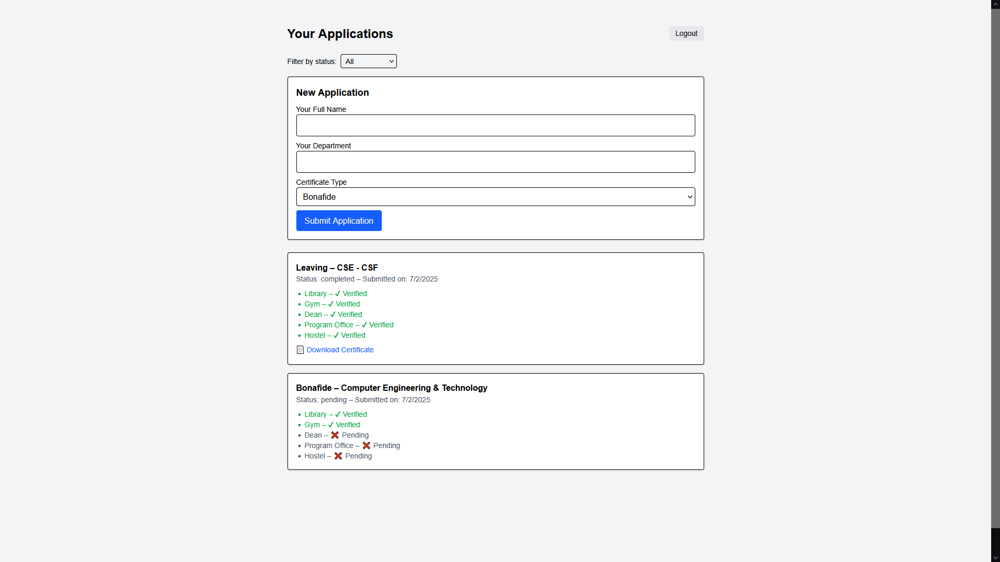
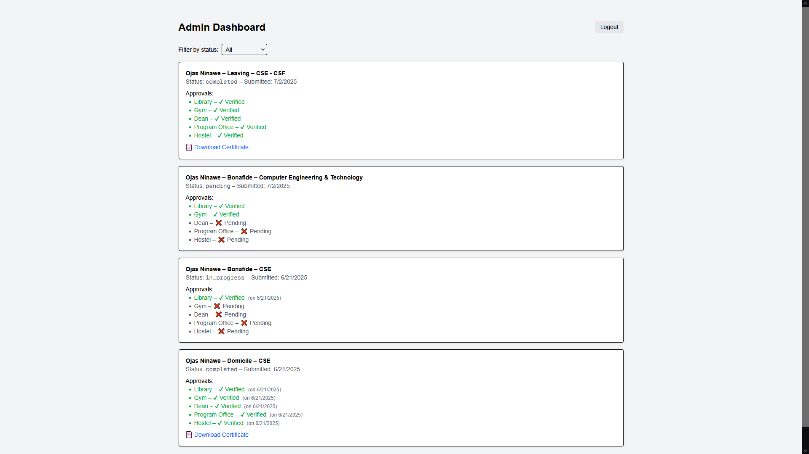
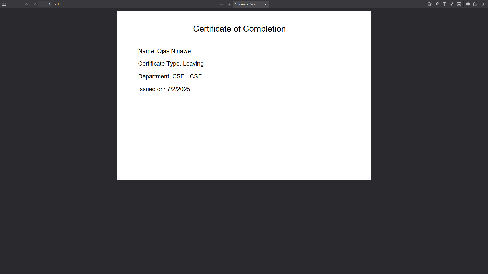

# College Certificate Portal

A web application for managing student certificate requests (Bonafide, Domicile, Leaving Certificate) with department-wise approval workflow.

**Live Demo:** [https://college-certificate-portal.vercel.app](https://college-certificate-portal.vercel.app)

## Screenshots





## Features

- Student portal for certificate applications
- Department-wise faculty verification system
- Auto-generated PDF certificates on approval
- Admin dashboard for oversight
- Role-based authentication (Student/Faculty/Admin)
- Application status tracking with approval history

## Tech Stack

- **Frontend:** Next.js 15 (App Router), React, Tailwind CSS
- **Backend:** Node.js API Routes  
- **Database:** MongoDB Atlas
- **Authentication:** JWT
- **PDF Generation:** pdf-lib

## Demo Accounts

**Student:**
- Email: `student@demo.com`
- Password: `test123`

**Faculty Accounts:**
- Library: `library@college.com` / `test123`
- Gym: `gym@college.com` / `test123`  
- Dean: `dean@college.com` / `test123`
- Program Office: `program@college.com` / `test123`
- Hostel: `hostel@college.com` / `test123`

**Admin:**
- Email: `admin@college.com`
- Password: `test123`

## Local Setup

```bash
git clone https://github.com/Xelane/College-Certificate-Portal.git
cd College-Certificate-Portal
npm install
```

Create `.env.local`:
```
MONGODB_URI=your-mongodb-uri
JWT_SECRET=your-secret-key
```

To run:
```bash
npm run dev
```
